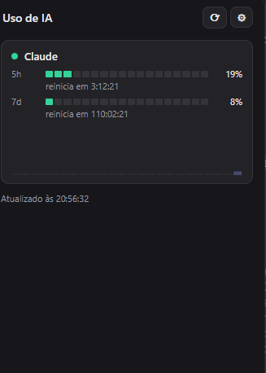

# Tray Usage Monitor

Monitor de bandeja do Windows para acompanhar o consumo de rate-limit do
**Claude** (e opcionalmente ChatGPT) em tempo real, sem precisar abrir o
terminal ou o site. Inspirado no gadget físico
[claude-usage-stick-SVGL](https://github.com/benevid/claude-usage-stick-SVGL).



## O que ele faz

- **Ícone na bandeja** que muda de cor conforme o uso (verde/âmbar/vermelho) e
  pisca quando o limite está crítico (≥70%).
- **Popup ao clicar no ícone** com:
  - Medidor segmentado (estilo LED) para as janelas de **5h** e **7 dias**.
  - Contagem regressiva ao vivo até o reset de cada janela.
  - Gráfico de tendência das últimas 24h, com linha pontilhada projetando o
    consumo até o horário de reset com base no ritmo atual.
  - Heatmap das últimas 24h (picos de uso por hora).
- **Notificações nativas do Windows** ao cruzar os limiares de **25%, 50%,
  75%, 90% e 100%** de uso (dispara uma vez por limiar, reseta quando a
  janela de rate-limit vira).
- **ChatGPT** (opcional): mostra tokens/custo das últimas 24h se você tiver
  uma API key de *Admin* da OpenAI Platform (não existe endpoint público de
  "% de quota restante" para o ChatGPT web).
- **Codex** (opcional, chaveável em Configurações): mostra as janelas de 5h/7d
  do Codex CLI. Ver seção [Codex](#codex) abaixo para os requisitos.
- **Antigravity**: sem suporte funcional por enquanto (chaveável em
  Configurações, mas a API local do Antigravity ainda retorna erro nesta
  versão — fica para uma investigação futura).
- Token e API keys ficam salvos no **Gerenciador de Credenciais do Windows**
  (via `keyring`), nunca em texto puro em disco.

## Como funciona por baixo dos panos

O app manda uma requisição mínima (`max_tokens: 1`) para
`POST /v1/messages` usando o token OAuth do Claude Code e lê os headers de
rate-limit unificados que a Anthropic retorna em toda resposta
(`anthropic-ratelimit-unified-5h-utilization` e `-7d-utilization`) — a mesma
técnica usada pelo projeto de referência. Não é uma API de billing separada;
é meio que um "efeito colateral" documentado das respostas normais da API.

## Codex

Diferente do Claude/ChatGPT, o Codex não pede token colado na UI — não há
campo de configuração no popup de Configurações além do checkbox pra
ligar/desligar o monitoramento. O provider lê o uso rodando
`codex app-server --stdio` (o mesmo backend JSON-RPC que a UI oficial do
Codex usa) e conversando com ele por stdin/stdout.

Requisitos para o card aparecer:

- **Codex CLI instalado e no PATH.** Ex.: `npm install -g @openai/codex`.
- **Autenticado**: `codex login` (ou já estar logado via ChatGPT — confirme
  com `codex login status`).
- Se o CLI não for encontrado ou a autenticação não estiver feita, o
  provider retorna "unavailable" e o card fica **oculto** no popup (mesmo
  comportamento do ChatGPT sem API key) — não aparece erro nenhum, então se
  o card não aparecer, o primeiro passo é rodar `codex login status` no
  terminal.

**Detalhe de plataforma (Windows):** a instalação global via `npm install -g`
cria um shim `.cmd`, e `CreateProcess`/`std::process::Command` do Rust não
executa `.cmd` diretamente (mesma limitação conhecida do `child_process.spawn`
do Node sem `shell:true`). Por isso o provider roteia o spawn por
`cmd /C codex app-server --stdio` no Windows — se um dia trocar a forma de
instalar o Codex (ex. binário standalone `.exe`), esse detalhe deixa de ser
necessário mas não atrapalha.

Pode ser desligado a qualquer momento em Configurações → Codex → "Monitorar
Codex" — desligado, o app nunca chega a spawnar o processo `codex`.

## Instalação

Baixe o instalador na aba [Releases](../../releases) (MSI ou NSIS/EXE) e
rode. Como não há assinatura de código, o Windows SmartScreen deve avisar
"Editor desconhecido" — é esperado para um app não publicado na Store.

Depois de instalado, clique no ícone da bandeja → engrenagem (⚙) →
cole o token do Claude (gerado com `claude setup-token` no terminal, requer
o [Claude Code](https://docs.claude.com/claude-code) instalado).

## Rodando a partir do código-fonte

### Pré-requisitos

- [Node.js](https://nodejs.org/) (18+)
- [Rust](https://www.rust-lang.org/tools/install) via `rustup`
- **Visual Studio Build Tools 2022** com o workload *Desktop development
  with C++* (necessário para compilar o backend Rust/Tauri no Windows)
- [WebView2 Runtime](https://developer.microsoft.com/microsoft-edge/webview2/)
  — já vem pré-instalado no Windows 11 e na maioria das instalações
  atualizadas do Windows 10

### Passos

```bash
npm install
npm run tauri dev    # roda em modo desenvolvimento
npm run tauri build  # gera os instaladores em src-tauri/target/release/bundle/
```

## Ícone da bandeja


O mascote é composto com um emblema colorido no canto indicando o status
(verde = ok, âmbar = atenção, vermelho = crítico/piscando, cinza =
indisponível). Os ícones são gerados a partir de
`src-tauri/icons/tray/mascot-source.png` pelo script
`src-tauri/icons/tray/generate-tray-icons.py` (requer Python 3 + Pillow) —
rode-o de novo se trocar a imagem-fonte do mascote.

## Stack

Tauri v2 (Rust + WebView2) no backend, HTML/CSS/JS puro no frontend
(sem framework), SQLite (`rusqlite`) para o histórico de uso.
